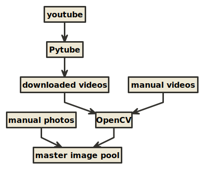

# **Project Summary**

> The process for developing our vehicle image classifier had 3 major stages. There were (1) data collection, (2) data processing and organization, and (3) classifier training. Step (1) was performed because there was no good open source of image data we could use or buy when we first started the project. We were forced to collect all the image data ourselves from the internet. Step (2) was performed because using the raw image data in the training process resulted in very long training times. We did our best to keep training times (and compute costs) low by converting our images to black-and-white. In some cases, we also removed company watermarks, and other unecessary objects from the images. We also extracted frames from videos we took of vehicles. A description of our video-to-image data pipeline is described below. Step (3) was the actual AI component of our project, where we trained an image classifier to recognize different kinds of vehicles using the data prepared in steps (1) and (2). You can find descriptions of each stage of the process below.

### **Step 1: Data Collection**

#### *(Part 1) Web Scrapers*

> We collected our image data from 3 major sources. We regularly (1) scraped major Korean used car websites because they were an excellent source of pre-labeled data. Because these sites want their customers to easily find the car they are looking for, we were able to leverage their filter system, and build web scrapers to extract much of the image data they were hosting. Our scraper was built using Selenium Web Driver (with the Python library), and Google Puppeteer (with the JavaScript library).

#### *List of Websites We Scraped*

* http://www.carmodoo.co.kr/
* http://www.encar.com/index.do
* http://spcarz.com
* http://usedcarmall.co.kr/
* http://autohub.co.kr/
* https://www.bobaedream.co.kr/

#### *(Part 2) Photos and Videos*

> After we scraped as much data from the websites listed above, we found that we were still lacking the appropriate amount of image data we needed to accurately train our image classifier. On a regular basis, our team would visit the physical locations of the major used car sellers and (2) manually take pictures and (3) videos of the vehicles on their lots. We would then manually classify the images and videos and then add them to our master data set. In the case of (3) videos we took of vehicles, we converted them to large amounts of images by extracting the frames of the video files into image files. We built scripts to perform this work automatically using the Python library for the open source tool, [OpenCV](https://opencv.org/). We used this same method of frame extraction to convert select Youtube videos into collections of images. We used the [Pytube](https://github.com/nficano/pytube) library to download videos from Youtube into our local environments, which we would then convert into images.

