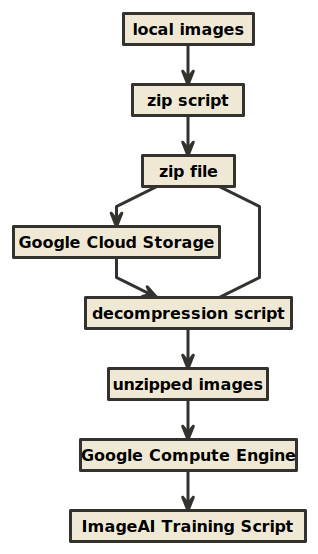
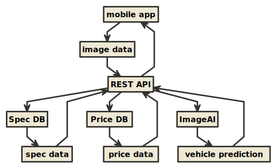

# **Project Summary**

> The process for developing our vehicle image classifier had 4 major stages. There were (1) data collection, (2) data processing and organization, (3) classifier training, and (4) mobile app integration. Step (1) was performed because there was no good open source of image data we could use or buy when we first started the project. We were forced to collect all the image data ourselves from the internet. Step (2) was performed because using the raw image data in the training process resulted in very long training times. We did our best to keep training times (and compute costs) low by converting our images to black-and-white. In some cases, we also removed company watermarks, and other unecessary objects from the images. We also extracted frames from videos we took of vehicles. A description of our video-to-image data pipeline is described below. In order to expand our body of image data, we performed several data augmentation techniques by transforming our images in various ways (e.g. image rotation, addition of blur and noise, etc.). Details concerning these image transformations can be found in a description below. Step (3) was the actual AI component of our project, where we trained an image classifier to recognize different kinds of vehicles using the data prepared in steps (1) and (2). You can find descriptions of each stage of the process below.

### **Step 1: Data Collection**

#### *(Part 1) Web Scrapers*

> We collected our image data from 3 major sources. We regularly (1) scraped major Korean used car websites because they were an excellent source of pre-labeled data. Because these sites want their customers to easily find the car they are looking for, we were able to leverage their filter system, and build web scrapers to extract much of the image data they were hosting. Our scraper was built using Selenium Web Driver (with the Python library), and Google Puppeteer (with the JavaScript library).

#### *List of Websites We Scraped*

* http://www.carmodoo.co.kr/
* http://www.encar.com/index.do
* http://spcarz.com
* http://usedcarmall.co.kr/
* http://autohub.co.kr/
* https://www.bobaedream.co.kr/

#### *(Part 2) Photos and Videos*

> After we scraped as much data from the websites listed above, we found that we were still lacking the appropriate amount of image data we needed to accurately train our image classifier. On a regular basis, our team would visit the physical locations of the major used car sellers and (2) manually take pictures and (3) videos of the vehicles on their lots. We would then manually classify the images and videos and then add them to our master data set. In the case of (3) videos we took of vehicles, we converted them to large amounts of images by extracting the frames of the video files into image files. We built scripts to perform this work automatically using the Python library for the open source tool, [OpenCV](https://opencv.org/). We used this same method of frame extraction to convert select Youtube videos into collections of images. We used the [Pytube](https://github.com/nficano/pytube) library to download videos from Youtube into our local environments, which we would then convert into images.

### **Step 2: Data Processing and Organization**

#### *(Part 1) Conversion to Black-And-White*

> After performing a few benchmarks, we found that removing color from our image data before training our image classifier could reduce our training times by up to 30% without any significant difference in classification accuracy. As a result, we converted our images to black-and-white throughout the development process of our image classifier. We did this again using the Python library for OpenCV.

#### *(Part 1) Image Transformations

> Because we did not have enough images to train our classifier, we expanded our dataset by performing transformations on the images we already had to generate new, modified images. We again used OpenCV to perform the image transformations listed below. Each transformation generated at least one new image that we could add to our dataset.

#### *Types of Image Transformations*

* `Image Translation`: Shifting the entire image left, right, up, or down allowed us to generate multiple new images from a single image.
* `Image Rotation`: Like `Image Translation`, by rotating the image by varying degrees, we were able to generate multiple new images.
* `Adding Salt-Pepper Noise`: We were able to generate new images by adding varying amounts of [salt-pepper noise](https://www.researchgate.net/profile/Atta_Rahman2/publication/280314734/figure/fig4/AS:307983025229827@1450440283959/Recovered-image-from-salt-and-pepper-noise.png) to our images.
* `Adding Gaussian Noise`: We were able to generate new images by adding varying amounts of [Gaussian noise](https://www.researchgate.net/profile/Jianhua_Wu3/publication/272201387/figure/fig7/AS:614046587957254@1523411523349/Decrypted-images-Barbara-and-Peppers-with-different-Gaussian-noise-intensities-k.png)
* `Cropping`: We generated additional images by auto-cropping our images so that objects in our images that were not the main vehicle were removed (as much as possible). We did this using the Python [smartcrop library](https://github.com/smartcrop/smartcrop.py) combined with OpenCV.

### **Step 3: Training the Image Classifier

#### *(Part 1) Data Compression, Cloud Storage*

> Loading image data into our cloud servers for training required that we first upload that data into cloud storage. We used Google Cloud Platform for all of our AI-related workloads. Within Google Cloud Platform, we used Compute Engine to run all of our training scripts, and Google Cloud Storage to hold all of our training data. Before each training session, we would compress and upload our most recent dataset to Google Cloud Storage, and then access that data from Google Compute Engine.

#### *(Part 2) Data Decompression, Classifier Training*

> From Compute Engine, we would download the compressed data set from Cloud Storage, decompress it, and then start our image classifier training script. We used the [ImageAI](https://github.com/OlafenwaMoses/ImageAI) Python library to train our image classifier. ImageAI is a wrapper around the the open source machine learning library called Keras. The ImageAI library's high level functionality allowed for us to quickly implement a classifier training script without having to worry too much about small details of tuning of our machine learning model. We did end up modifying the `number of training epochs` and `batch size` in order to improve the performance of our classifier. Each time we trained our image classifier, it took up to 3 days to finish. The output from this process was an image classification model that could be used by our mobile app backend.

### **Step 4: Image Classifier Server, Mobile App Integration

#### *(Part 1) Image Classifier Server

> We built a simple REST API server using the [Flask](https://github.com/pallets/flask) library, a Python library for building APIs. The job of that server was to load in the image classifier model that we generated in the previous step, accept vehicle prediction requests from a mobile app, and respond to that request with the correct prediction (vehicle brand, model, year, etc.). This server also had access to our database of vehicle prices and physical specs, and included that data in its responses to requests from our mobile app.

#### *(Part 2) Mobile App Integration*

> The final step of our project was to modify our mobile app to send image data to our REST API, receive data from our REST API, and display that data. In order to do this, we had to add two sections to our existing mobile app. The first section was button that activated the camera of the mobile phone, and sent that image data to our REST API. The second section was page that displayed the photo, and all of the predicted vehicle data for that photo (including what kind of vehicle it was, the physical specs of that vehicle, and the estimated price range). 

